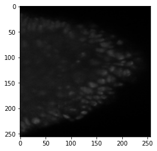
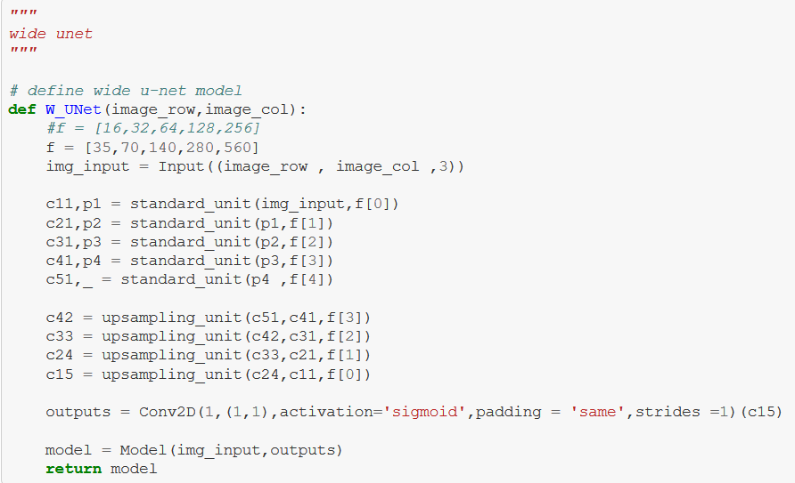

# NCBS-Internship-Project
## Image Segmentation of Cell Membanes using U-net

**Author**: SHAILESH_DHAMA

## About the Internship Objectives:

-> Dataset provided by the Supervisor.

-> Prepare U-Net model architecture according to the dataset.

## PROGRESS OF THE INTERNSHIP:

--> First 2 weeks of the Internship mainly focused on learning of the U-net,Data Cleaning from a large chunk of 1.3 TB data

--> Internship included intensive learning of machine learning,deep learning modules and the extensive thoughtful implementation of creating           different models,trying different activation functions for tuning the models.

#### Notebook 1: Learning Family of U-nets.ipynb

#### Final Notebook : Image Segmentation of Cell Membranes using U-net.ipynb

### LIBRARIES:

    1.Numpy
    2.Pandas
    3.Matplotlib
    4.Scikit-image
    5.Keras
    6.Tensorflow
    
## Steps:

##### Image Segmentation of Cell Membranes using U-net

    1.Load required libraries
    2.Defining functions and loading required data.
    3.Defining U-Net model and metrics
    4.Predicting masks for test images
    5.Defining U-Net model
        - Let's add few early stopping
        - Monitoring Losses
    6.Plot Learning Curve
    7.Model Testing with different activation functions
    --- Elu activation
    --- Sigmoid activation
    --- ReLU activation
    8.Trying Avgpool instead of Maxpool
    (***Reason: Max pooling extracts the most important features like edges whereas, average pooling extracts features so smoothly)

##### Learning Family of U-nets:
    - Modelling of UNet,Wide-UNet and Nested-UNet.

## RESULTS:

#### Image Masking




#### Standard U-Net


#### Wide U-Net


#### Nested U-Net


#### Final_result


### For further information

Please review the narrative of our analysis in [our jupyter notebook](./Image%20Segmentation%20of%20Cell%20Membranes%20using%20U-net.ipynb)

For any additional questions, please contact **shaileshshettyd@gmail.com)


##### Repository Structure:

```
├── README.md                                               <- The top-level README for reviewers of this project.
├── Image Segmentation of Cell Membranes using U-net.ipynb  <- narrative documentation of analysis in jupyter notebook
└── images                                                  <- both sourced externally and generated from code
``
